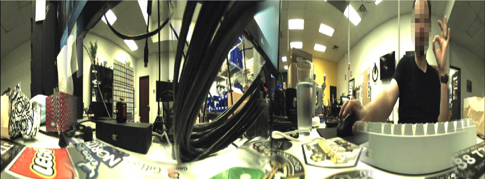
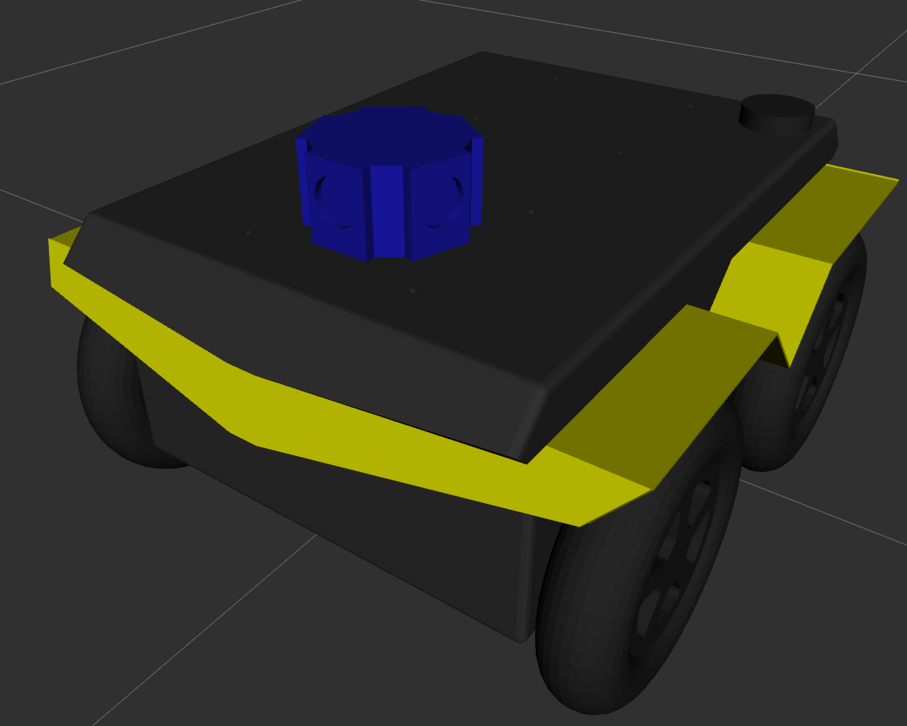

occam_ros
=============

This repository contains a lightly modified clone of the ROS driver for the Occam Omni 60, and other compatible
cameras, originally available here: http://occamvisiongroup.com/indigosdk/

The majority of the changes to this repo have been with the intention of making it easier to build and use on
ROS Melodic.

The `indigosdk` folder contains the original `libindigo` source from Occam, but with the compilation options changed
to produce the less-generic `liboccam.so` output.  The CMake files for the ROS package have similarly been altered
to link against `liboccam` instead of `libindigo`.




Building & Dependencies
----------------------------

Building the package should be as simple as cloning the repo, installing the dependencies, and building with
`catkin_make`

```bash
mkdir -p ~/catkin_ws/src
cd ~/catkin_ws
catkin_init_workspace src
cd src
git clone https://github.com/civerachb-cpr/occam_ros.git
rosdep install --from-paths . --ignore-src -r -y
cd ..
catkin_make
```

It is recommended to copy the `debian/udev` file to your udev rules to ensure the camera device has the correct
permissions.

```bash
sudo cp ~/catkin_ws/src/occam_ros/debian/udev /etc/udev/rules.d/60-occam.rules
sudo udevadm control --reload-rules
sudo udevadm trigger
```


Usage
----------

You can either add the `occam_driver_node` to an existing launch file, or use the provided one.

```bash
roslaunch occam_ros omni_60.launch
```

A simple URDF macro is included for adding the camera to your existing robot model.

```xml
<xacro:include filename="$(find occam_ros)/urdf/omni_60.urdf.xacro" />
<xacro:omni_60 name="omnicam" parent="front_mount">
  <origin xyz="0 0 0" rpy="0 0 0" />
</xacro:omni_60>
```




Future Work
--------------

Right now this driver is a straight copy of the original source code.  I've done my best to copy all the available
documentation, but it's not much right now.

The to-do list includes:

- add (or document the existing) configuration options
- document all published & subscribed topics
- double-check the order of the 5 cameras and match the URDF to that order
- assign frame IDs to the raw data from each camera
